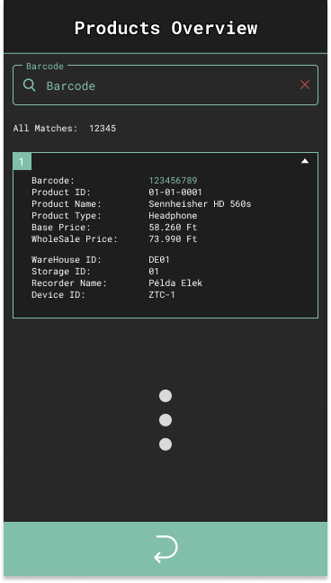
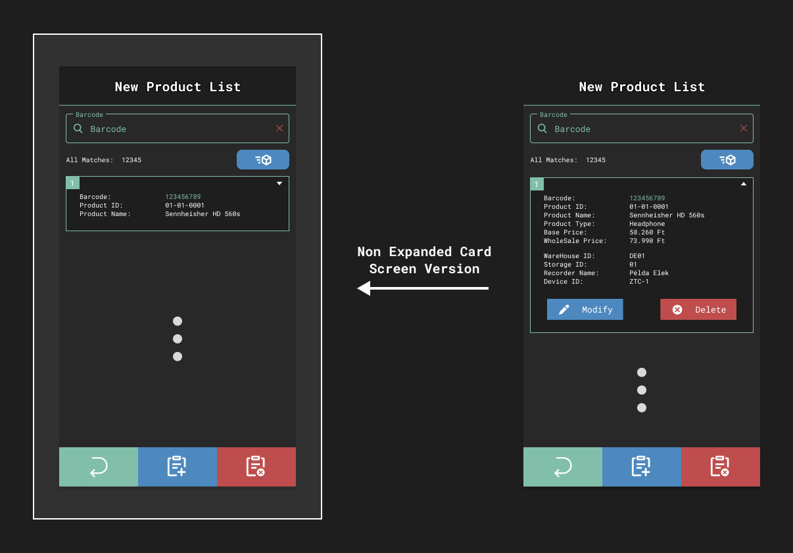
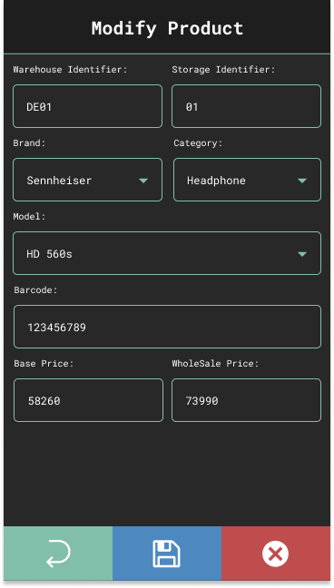
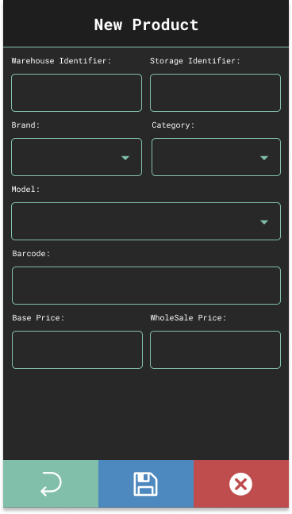

    

    <h1 style="border-bottom: 0">AudioShop Inventory Management</h1>
    <h3>Mobil Alkalmazás (Frontend)</h3>
    <h4>Portfólió munka</h4>
     

---

    <h3>A projekt leírása:</h3>

- Az alkalmazás fő célja, hogy segítse a bolt leltározásának folyamatát.
- A program futtatásához szükséges operációs rendszer: minimum <b>Android 8 (Oreo)</b>
- Backend: <a href="https://github.com/galmihaly/AudioShopInventoryManagementRestAPI">AudioShopInventoryManagementAPI</a> (bíztosítja az alkalmazáshoz szükséges adatokat)

---

    <h3>A projekthez felhasznált, Kotlin alapú főbb osztályok, csomagok:</h3>

- Ui: Jetpack Compose
- Navigáció: Jetpack Compose Navigation
- Dependency Injection: Hilt és Dagger
- API kezelés: Retrofit, OkHttp
- API válaszok kezelése: JSON Serializáció
- Adatok tárolása: Room és ProtDatastore
- JWT (JSON Web Token): JWT Decode (<a href="https://github.com/auth0/JWTDecode.Android">Auth0 by Okta</a>)

---

    <h3>Az alkalmazás grafikai megjelenése:</h3>

- A program grafikáját a jelenleg piacon lévő PDA-k közül a <b>ZEBRA TC-51</b> eszköz alapján terveztem meg, amellyel korábbi munkám során már valós projekt esetén is foglalkoztam.
- A projekt elkészítése során ilyen eszközzel azonban nem rendelkeztem, viszont Android Studio-ban a mobil alapú emulátorok közül a <b>Google Pixel 2</b>-es telefon paraméterei pontosan megfeleltek a <b>TC-51</b>-es PDA eszköz paraméterei alapján.
- Az alkalmazás elemeinek elhelyezkedéseit, méreteit és megjelenésüket <b>Figma</b>-ban készítettem el.
- A logót, valamint az alkalmazásban megtalálható összes ikont pedig az <b>Adobe Illustrator</b> nevű program segítségével alkottam meg.
- Az alkalmazás grafikája (logót és design-t egybevéve) nem tartozik egyetlen valós céghez sem, csak a projekt érdekéken készítettem el.

---

         
        <h2>A projekt részletes leírása</h2>
         

        
        
A különbőző felületek közti kapcsolatok és egyes felületek másik verzójának kinézetei

         

---

    

         
        <h2>Bejelentkező felület</h2>
         
        
    

     

- Amikor az alkalmazás elindul, akkor ez az első oldal, amely megjelenik a felhasználó számára.
- Az adatbázisba beregisztrált felhasználó email és jelszó beírásával tud bejelentkezni.
- A bejelentkezés <b>JWT (Json Web Token)</b> segítségével történik: az email és jelszó továbbítódik a backend oldalra, ahol az adatbázis segítségével a rendszer először ellenőrzi a személy azonosságát, majd ha sikeres a bejelentkezés, akkor az API visszaküld egy olyan üzenetet, amely tartalmaz két tokent.
- A tokennek két típusból állnak:
  - Hozzáférési token (256 bites RSA kulccsal titkosítva)
  - Frissítési token: ha lejár a hozzáférési token (30 perc), akkor ezzel tudunk újat kérni backend oldaról.

---

    

         
        <h2>Kezdő felület</h2>
         
        
    

     

- Sikeres bejelentkezés után ez a felület fogadja a felhasználót.
- Itt tudja eldönteni a felhasználó, hogy készít egy új, termékekből álló listát, vagy megnézi, hogy mennyi és milyen termék van már elmentve az adatbázisban.

---

    

         
        <h2>Áruház felület</h2>
         
        
    

     

- A készlet (Stocks) gomb megnyomása után ez az oldal fogja fogadni a felhasználót.
- Ha egy nem <b>Admin</b> joggal beregisztrált felhasználó jelentkezik be, akkor csak azt az áruház adatait látja, ahová a beregisztrált felhasználó is be van jegyezve az adatbázisban.
- <b>Admin</b> jog esetén egy, az összes bejegyzett áruház adataiból álló lista lesz látható, így az ezzel a joggal bejelentkező személy látni fogja az összes áruház készletét.
 

---

    

         
        <h2>Tároló felület</h2>
         
        
    

     

- Ha az <b>Áruház</b> felületen rákattintunk egy áruház "kártyára", akkor ez a felület fogja fogadni a felhasználót.
- Itt fogjuk látni a kiválasztott áruházban megtalálható úgynevezett "tárolók" adatait.
- <b>Megjegyzés: A tárolók vonalkód kezelése a programban le van egyszerűsítve egyetlen vonalkódra, a valóságban ennél többre van szükség.</b>
- Egy tároló kártyán látjuk a:
  - tároló azonosító kódját
  - jelenlegi mennyiséget, amit ott tárolunk
  - maximális mennyiséget, amit ott tárolhatunk
  - az itt található egyes áruk nettó (áfa nélküli) összegét
  - az itt található egyes áruk bruttó (áfával számított) összegét
- Tároló lehet:
  - RFID kóddal ellátott doboz
  - Polcos kialakítású szekrény, ahol a szekrény egyes, különválasztott részei szintén RFID kóddal van ellátva.

        
        
Egy valós példa a tároló vonalkódjára

---

    

         
        <h2>Termékek áttekintése felület</h2>
         
        
    

     

- Ha a <b>Tároló</b> felületen rákattintunk egy tároló "kártyára", akkor ez a felület fogja fogadni a felhasználót.
- Ezen a felületen tudja áttekinteni a rögzítő személy az eddig adatbázisba felvett termékeket.
- A termékek közt RFID alapján lehet keresni, amelyet a PDA segítségével tud beolvasni a rögzítő személy (be lehet manuálisan is írni a kódot)
- Egy termék kártyán látjuk:
  - a termék egyedi RFID kódját
  - a termék adatbázisban tárolt, termék kategóriájának (Brand-Categória-Model) azonosító kódját (erről később lesz magyarázat)
  - a termék neve (Brand-Model)
  - a termék netto (áfa nélküli) árát
  - a termék brutto (áfával számított) árát
  - az áruház azonosítóját, ahová el lett tárolva a termék
  - az tároló azonosítóját, ahová el lett tárolva a termék
  - a terméket rögzítő személy neve
  - az felvevő eszköz azonosítója, amiről a felhasználó rögzítette a terméket

---

    

         
        <h2>Új terméklista készítése felület</h2>
         
        
    

     

- Ha a <b>Kezdő</b> felületen rákattintunk a <b>Create New List</b> gombra, akkor ez a felület fogja fogadni a felhasználót.
- Ezen a felületen tudjuk kezelni az új termékek felvételét, amelyeket listába rendezve tudjuk áttekinteni hozzáadás után.
- A termékek közt RFID alapján lehet keresni, amelyet a PDA segítségével tud beolvasni a rögzítő személy (be lehet manuálisan is írni a kódot)
- Ha egy terméket hozzáadtunk a listához, akkor azokat utólag tudjuk módosítani, vagy magát, az egész terméket törölni a listából.
- Az <b>All Matches</b> résznél látjuk, hogy a listában mennyi termék van (keresés során azt mutatja, hogy mennyi terméket talált meg a keresett RFID által)
- Az <b>All Matches</b> résszel ellentétes oldalon található gombbal tudjuk elküldeni a listát a <b>Backend</b> oldalra (a lista feldolgozása backend oldalon történik, itt csak össeállítjuk a termékfelvételhez szükséges adatcsomagot).
- Az alsó sávban 3 gomb található:
  - Az 1. gombbal vissza tudunk menni az előző oldalra
  - A 2. gombbal egy új terméket tudunk felvenni listára (új oldalra visz át)
  - A 3. gombbal magát az egész listát törölni tudjuk (nem visz át egy másik oldalra)

---

    

         
        <h2>Termék módosítása felület</h2>
         
        
    

     

- Ha az <b>Új termék lista készítése</b> felületen rákattintunk az egyik termék <b>Módosítás</b> gombjára, akkor ez a felület fogja fogadni a felhasználót.
- Itt tudjuk megváltoztatni a termék:
  - az Áruház azonosítóját
  - az tároló azonosítóját
  - márkáját (Brand)
  - kategóriáját (Category)
  - modeljét (Model)
  - RFID kódját
  - netto árát (áfa nélküli)
  - bruttó árát (áfával számított)
- Az alsó sávban 3 gomb található:
  - Az 1. gombbal vissza tudunk menni az előző oldalra
  - A 2. gombbal menteni tudjuk a változtatást (mentés után visszavisz az előző oldalra)
  - A 3. gombbal törölni tudjuk az összes mező tartalmát
- Az áruház azonosítója annyiban különbözik a többitől, hogy ezt a felhasználó jogától függően lehet változtatni. 
  - Csak <b>Admin</b> joggal lehet változtani vagy törölni a változtatás vagy törlés.
  - Egyéb jog esetén nem lehetséges a módosítás, ami azt jelenti, hogy egy bejelentkezett személy csak és kizárólag ahhoz az áruházhoz adhat hozzá terméket, amihez a személy be van regisztrálva.
- Ha valamelyik mezőt módosítjuk, de mentés nélkül akarunk kilépni, akkor egy felúgró ablak fogja fogadni a felhasználót, amely a mentés nélküli kilépést fogja megkérdezni és a felhasználó dönthet hogy kilép-e mentés nélkül vagy sem.

---

    

         
        <h2>Új termék létrehozása felület</h2>
         
        
    

     

- Ha az <b>Új termék lista készítése</b> felületen az alsó sávban rákkattintunk a 2. gombra, akkor ez a felület fogja fogadni a felhasználót.
- Funkcionalitás szempontjából ugyanaz mint a <b>Termék módosítása</b> felület, annyi különbséggel, hogy mezők üresek a felület megnyítódásakor.
  - Kivétel az áruház azonosító mező, ahol az <b>Admin</b> joggal ellentétben kitöltődik a felhasználóhoz regisztrált áruház azonosítójával (ezt a mezőt sem módosítani, sem törölni nem lehet).