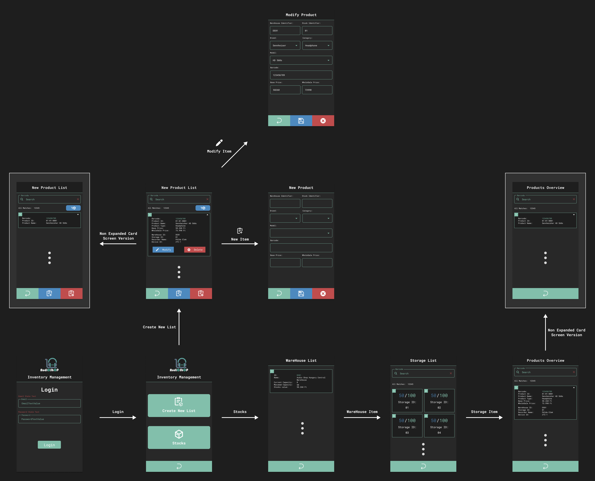
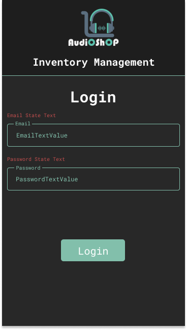
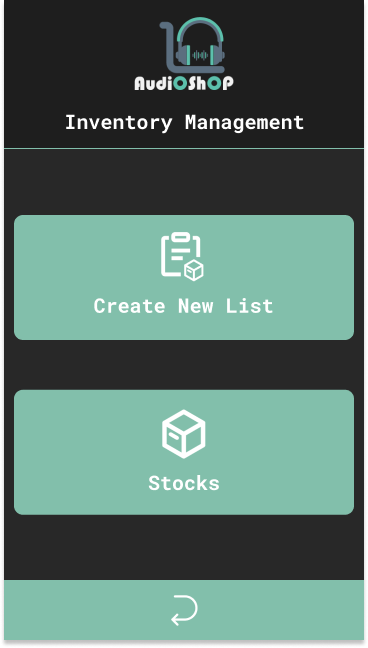
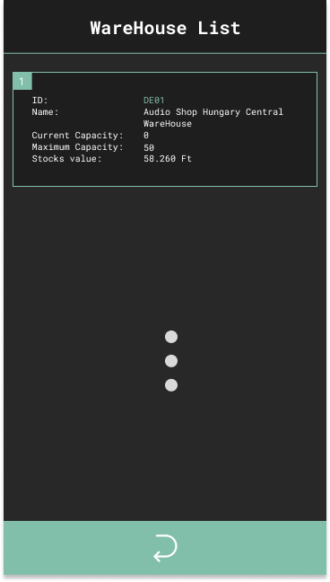
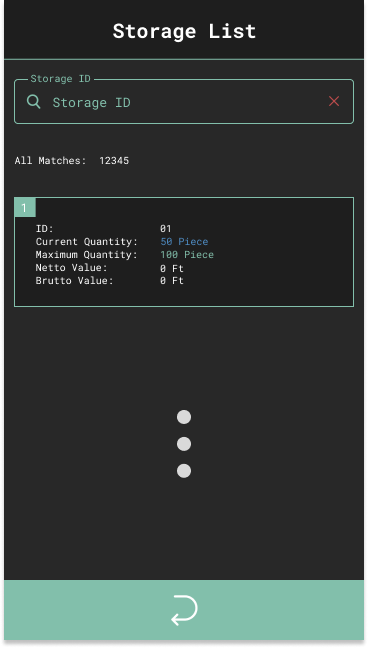
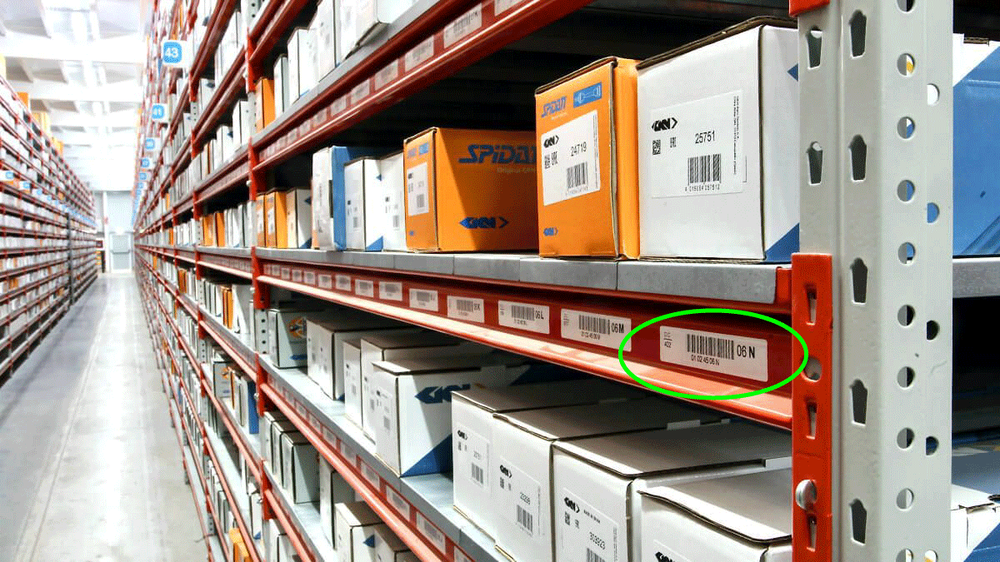

    

    <h1 style="border-bottom: 0">AudioShop Inventory Management</h1>
    <h3>Mobil Alkalmazás (Frontend)</h3>
    <h4>Portfólió munka</h4>
     

---

    <h3>A projekt leírása:</h3>
    <ul style="font-size: 20px">
        <li>Az alkalmazás fő célja, hogy segítse a bolt leltározásának folyamatát.</li>
        <li>A szoftver úgy lett megalkotva, hogy tudjon futni Android alapú, vonalkód olvasására képes PDA eszközökön, azon belül is az <b>Android 8 (Oreo)</b> alapú eszközökön.</li>
        <li>Az alkalmazáshoz hozzátartozik az <a href="https://github.com/galmihaly/AudioShopInventoryManagementRestAPI">AudioShopInventoryManagementAPI</a> program is, ami az alkalmazás backend részét valósítja meg, ez fogja az adatokat szolgáltatni az alkalmazás számára.</li>
    </ul>

---

    <h3>Az alkalmazás grafikai megjelenése:</h3>
    <ul style="font-size: 20px">
        <li>A program grafikáját a jelenleg piacon lévő PDA-k közül a <b>ZEBRA TC-51</b> eszköz alapján terveztem meg, amellyel korábbi munkám során már valós projekt esetén is foglalkoztam.</li>
        <li>A projekt elkészítése során ilyen eszközzel azonban nem rendelkeztem, viszont Android Studio-ban a mobil emulátorok közül a <b>Google Pixel 2</b>-es telefon paraméterei pontosan megfeleltek a <b>TC-51</b>-es PDA eszköz paraméterei alapján.</li>
        <li>Az alkalmazás elemeinek elhelyezkedéseit, méreteit és megjelenésüket <b>Figma</b>-ban készítettem el.</li>
        <li>A logót, valamint az alkalmazásban megtalálható összes ikont pedig az <b>Adobe Illustrator</b> nevű program segítségével alkottam meg.</li>
        <li>Az alkalmazás grafikája (logót és dizájnt egybevéve) nem tartozik egyetlen valós céghez sem, csak a projekt érdekéken készítettem el.</li>
    </ul>

---

        <h2>A projekt részletes leírása</h2>
         

        
        
A különbőző felületek közti kapcsolatok és egyes felületek másik verzójának kinézetei

[//]: # (
)

[//]: # (    <h3>A program részei:</h3>)

[//]: # (    <ul style="font-size: 20px">)

[//]: # (        <li>A progamnak 3 fő része van:)

[//]: # (            <ol style="list-style-type: square;">)

[//]: # (                <li>Bejelentkező felület</li>)

[//]: # (                <li>Terméklista készítő felület</li>)

[//]: # (                <li>Terméklista átekintő felület</li>)

[//]: # (            </ol>)

[//]: # (        </li>)

[//]: # (    </ul>)

[//]: # (
)

---

    

        <h2>Bejelentkező felület</h2>
         
        
    

     
    <ul style="font-size: 20px">
        <li>Amikor az alkalmazás elindul, akkor ez az első oldal, amely megjelenik a felhasználó számára.</li>
        <li>Az adatbázisba beregisztrált felhasználó email és jelszó beírásával tud bejelentkezni.</li>
        <li>A bejelentkezés <b>JWT (Json Web Token)</b> segítségével történik: az email és jelszó továbbítódik a backend oldalra, ahol az adatbázis segítségével a rendszer először ellenőrzi a személy azonosságát, majd ha sikeres a bejelentkezés, akkor az API visszaküld egy olyan üzenetet, amely tartalmaz két tokent.</li>
        <li>A tokennek két típusból állnak:
            <ol style="list-style-type: square;">
                <li>Hozzáférési token (256 bites RSA kulccsal titkosítva)</li>
                <li>Frissítési token: ha lejár a hozzáférési token (30 perc), akkor ezzel tudunk újat kérni backend oldaról.</li>
            </ol>
        </li>
    </ul>

---

    

        <h2>Kezdő felület</h2>
         
        
    

     
    <ul style="font-size: 20px">
        <li>Sikeres bejelentkezés után ez a felület fogadja a felhasználót.</li>
        <li>Itt tudja eldönteni a felhasználó, hogy készít egy új, termékekből álló listát, vagy megnézi, hogy mennyi és milyen termék van már elmentve az adatbázisban.</li>
    </ul>

---

    

        <h2>Áruház felület</h2>
         
        
    

     
    <ul style="font-size: 20px">
        <li>A készlet (Stocks) gomb megnyomása után ez az oldal fogja fogadni a felhasználót.</li>
        <li>Ha egy nem <b>Admin</b> joggal beregisztrált felhasználó jelentkezik be, akkor csak azt az áruház adatait látja, ahová a beregisztrált felhasználó is be van jegyezve az adatbázisban.</li>
         <li><b>Admin</b> jog esetén egy, az összes bejegyzett áruház adataiból álló lista lesz látható, így az ezzel a joggal bejelentkező személy látni fogja az összes áruház készletét.</li>
    </ul>

---

    

        <h2>Tároló felület</h2>
         
        
    

     
    <ul style="font-size: 20px">
        <li>Ha az <b>Áruház</b> felületen rákattintunk egy áruház "kártyára", akkor ez a felület fogja fogadni a felhasználót.</li>
        <li>Itt fogjuk látni a kiválasztott áruházban megtalálható úgynevezett "tárolók" adatait.</li>
        <li><b>Megjegyzés: A tárolók kezelése a programban le van egyszerűsítve egyetlen vonalkódra, a valóságban ennél többre van szükség.</b></li>
        <li>Tároló lehet:
            <ol style="list-style-type: square;">
                <li>RFID kóddal ellátott doboz</li>
                <li>Polcos kialakítású szekrény, ahol a szekrény egyes fiókjai (külön választott részei) szintén RFID kóddal van ellátva.</li>
            </ol>
        </li>
    </ul>

        

