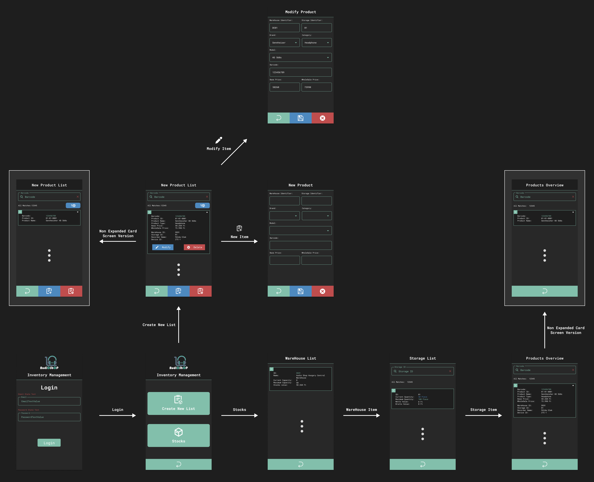

    

    <h1 style="border-bottom: 0">AudioShop Inventory Management</h1>
    <h3>Mobil Alkalmazás (Frontend)</h3>
    <h4>Portfólió munka</h4>
     

---

    <h3>A projekt leírása:</h3>

- Az alkalmazás fő célja, hogy segítse a bolt leltározásának folyamatát.
- A szoftver úgy lett megalkotva, hogy tudjon futni Android alapú, vonalkód olvasására képes PDA eszközökön, azon belül is az <b>Android 8 (Oreo)</b> alapú eszközökön.
- Az alkalmazáshoz hozzátartozik az <a href="https://github.com/galmihaly/AudioShopInventoryManagementRestAPI">AudioShopInventoryManagementAPI</a> program is, ami az alkalmazás backend részét valósítja meg, ez fogja az adatokat szolgáltatni az alkalmazás számára.

---

    <h3>Az alkalmazás grafikai megjelenése:</h3>

- A program grafikáját a jelenleg piacon lévő PDA-k közül a <b>ZEBRA TC-51</b> eszköz alapján terveztem meg, amellyel korábbi munkám során már valós projekt esetén is foglalkoztam.
- A projekt elkészítése során ilyen eszközzel azonban nem rendelkeztem, viszont Android Studio-ban a mobil emulátorok közül a <b>Google Pixel 2</b>-es telefon paraméterei pontosan megfeleltek a <b>TC-51</b>-es PDA eszköz paraméterei alapján.
- Az alkalmazás elemeinek elhelyezkedéseit, méreteit és megjelenésüket <b>Figma</b>-ban készítettem el.
- A logót, valamint az alkalmazásban megtalálható összes ikont pedig az <b>Adobe Illustrator</b> nevű program segítségével alkottam meg.
- Az alkalmazás grafikája (logót és dizájnt egybevéve) nem tartozik egyetlen valós céghez sem, csak a projekt érdekéken készítettem el.

---

        <h2>A projekt részletes leírása</h2>
         

        
        
A különbőző felületek közti kapcsolatok és egyes felületek másik verzójának kinézetei

[//]: # (
)

[//]: # (    <h3>A program részei:</h3>)

[//]: # (    <ul style="font-size: 20px">)

[//]: # (        <li>A progamnak 3 fő része van:)

[//]: # (            <ol style="list-style-type: square;">)

[//]: # (                <li>Bejelentkező felület</li>)

[//]: # (                <li>Terméklista készítő felület</li>)

[//]: # (                <li>Terméklista átekintő felület</li>)

[//]: # (            </ol>)

[//]: # (        </li>)

[//]: # (    </ul>)

[//]: # (
)

---

    

        <h2>Bejelentkező felület</h2>
         
        
    

     

- Amikor az alkalmazás elindul, akkor ez az első oldal, amely megjelenik a felhasználó számára.
- Az adatbázisba beregisztrált felhasználó email és jelszó beírásával tud bejelentkezni.
- A bejelentkezés <b>JWT (Json Web Token)</b> segítségével történik: az email és jelszó továbbítódik a backend oldalra, ahol az adatbázis segítségével a rendszer először ellenőrzi a személy azonosságát, majd ha sikeres a bejelentkezés, akkor az API visszaküld egy olyan üzenetet, amely tartalmaz két tokent.
- A tokennek két típusból állnak:
  - Hozzáférési token (256 bites RSA kulccsal titkosítva)
  - Frissítési token: ha lejár a hozzáférési token (30 perc), akkor ezzel tudunk újat kérni backend oldaról.

---

    

        <h2>Kezdő felület</h2>
         
        
    

     

- Sikeres bejelentkezés után ez a felület fogadja a felhasználót.
- Itt tudja eldönteni a felhasználó, hogy készít egy új, termékekből álló listát, vagy megnézi, hogy mennyi és milyen termék van már elmentve az adatbázisban.

---

    

        <h2>Áruház felület</h2>
         
        
    

     

- A készlet (Stocks) gomb megnyomása után ez az oldal fogja fogadni a felhasználót.
- Ha egy nem <b>Admin</b> joggal beregisztrált felhasználó jelentkezik be, akkor csak azt az áruház adatait látja, ahová a beregisztrált felhasználó is be van jegyezve az adatbázisban.
- <b>Admin</b> jog esetén egy, az összes bejegyzett áruház adataiból álló lista lesz látható, így az ezzel a joggal bejelentkező személy látni fogja az összes áruház készletét.
 

---

    

        <h2>Tároló felület</h2>
         
        
    

     

- Ha az <b>Áruház</b> felületen rákattintunk egy áruház "kártyára", akkor ez a felület fogja fogadni a felhasználót.
- Itt fogjuk látni a kiválasztott áruházban megtalálható úgynevezett "tárolók" adatait.
- <b>Megjegyzés: A tárolók kezelése a programban le van egyszerűsítve egyetlen vonalkódra, a valóságban ennél többre van szükség.</b>
- Tároló lehet:
  - RFID kóddal ellátott doboz
  - Polcos kialakítású szekrény, ahol a szekrény egyes, különválasztott részei szintén RFID kóddal van ellátva.
- Egy tároló kártyán látjuk a:
  - tároló azonosító kódját
  - jelenlegi mennyiséget, amit ott tárolunk
  - maximális mennyiséget, amit ott tárolhatunk
  - az itt található egyes áruk nettó (áfa nélküli) összegét
  - az itt található egyes áruk bruttó (áfával számított) összegét

        

---

    

        <h2>Termékek áttekintése felület</h2>
         
        
    

     

- Ha a <b>Tároló</b> felületen rákattintunk egy tároló "kártyára", akkor ez a felület fogja fogadni a felhasználót.
- Ezen a felületen tudja áttekinteni a rögzítő személy az eddig adatbázisba felvett termékeket.
- A termékek közt RFID alapján lehet keresni, amelyet a PDA segítségével tud beolvasni a rögzítő személy (be lehet manuálisan is írni a kódot)
- Egy termék kártyán látjuk:
  - a termék egyedi RFID kódját
  - a termék adatbázisban tárolt, termék kategóriájának (Brand-Categória-Model) azonosító kódját (erről később lesz magyarázat)
  - a termék neve (Brand-Model)
  - a termék netto (áfa nélküli) árát
  - a termék brutto (áfával számított) árát
  - az áruház azonosítóját, ahová el lett tárolva a termék
  - az tároló azonosítóját, ahová el lett tárolva a termék
  - a terméket rögzítő személy neve
  - az felvevő eszköz azonosítója, amiről a felhasználó rögzítette a terméket

---

    

        <h2>Új terméklista készítése felület</h2>
         
        
    

     

